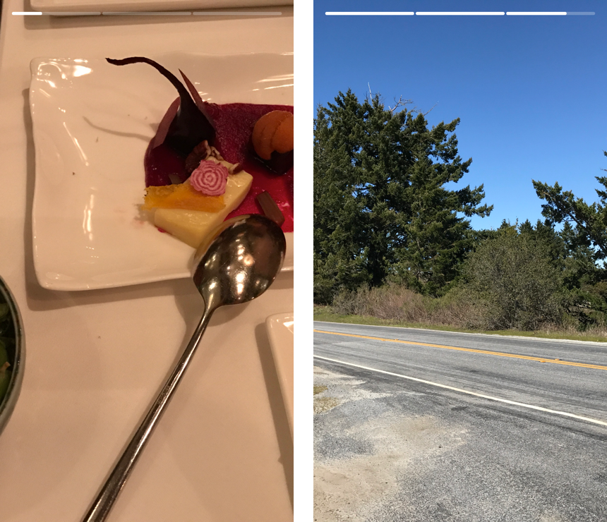

[![Swift Version][swift-image]][swift-url]
[](https://twitter.com/dylan36032)

# SegmentedProgressBar
A simple little control that animates segments like Snapchat or Instagram Stories.



## Requirements
- iOS 8.0+
- Xcode 8

## Installation

Drag and drop `SegmentedProgressBar.swift` into your project. That's it.

## Usage

```swift
let spb = SegmentedProgressBar(numberOfSegments: 3, duration: 5)
spb.frame = CGRect(x: 15, y: 15, width: view.frame.width - 30, height: 4)
view.addSubview(spb)

spb.startAnimation()
```

## Additional Stuff
Delegate:

```swift
spb.delegate = self // has to conform to SegmentedProgressBarDelegate

func segmentedProgressBarChangedIndex(index: Int) {
}

func segmentedProgressBarFinished() {
}
```

Styling:

```swift
spb.topColor = UIColor.white
spb.bottomColor = UIColor.white.withAlphaComponent(0.25)
spb.padding = 2
```

Pausing / Resuming

```swift
spb.isPaused = true
spb.isPaused = false
```

Skip / Rewind

```swift
spb.skip()
spb.rewind()
```

[swift-image]:https://img.shields.io/badge/swift-3.0-orange.svg
[swift-url]: https://swift.org/